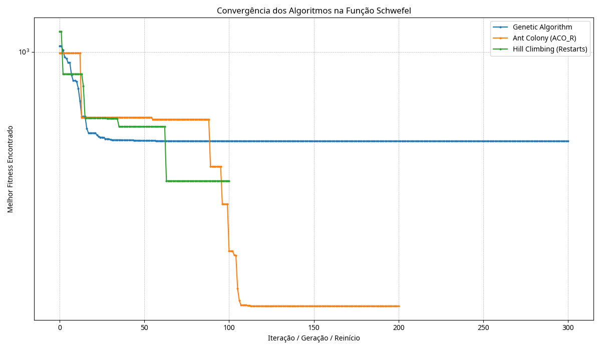
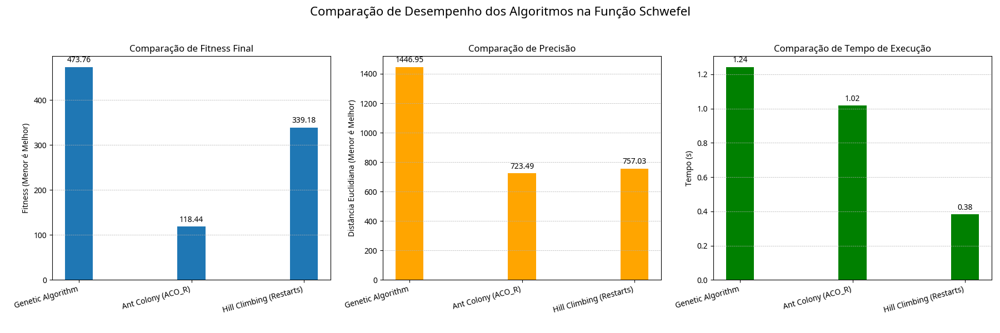

# Relatório de Otimização da Função Schwefel

## Introdução

Este relatório detalha a implementação e comparação de três algoritmos de otimização metaheurística aplicados à minimização da função Schwefel, conforme solicitado na segunda parte do Projeto 01. A função Schwefel é conhecida por sua complexidade, apresentando múltiplos mínimos locais, o que a torna um benchmark desafiador para algoritmos de otimização contínua. O objetivo foi encontrar a solução que mais se aproxima do mínimo global conhecido para a função em 5 dimensões, dentro do intervalo [-500, 500] para cada dimensão.

## Metodologia

Foram implementados os seguintes algoritmos em Python:

1.  **Algoritmo Genético (GA):** Uma abordagem populacional que simula o processo de evolução natural, utilizando operadores como seleção por torneio, crossover aritmético e mutação gaussiana. A configuração utilizada foi: 100 indivíduos na população, 300 gerações, taxa de mutação de 0.1, taxa de crossover de 0.8 e tamanho do torneio de 5.
2.  **Otimização por Colônia de Formigas para Contínuo (ACO_R):** Uma adaptação do algoritmo de colônia de formigas para problemas de otimização em espaços contínuos. Utiliza um arquivo de soluções ponderado para guiar a busca, amostrando novas soluções a partir de distribuições gaussianas centradas nas melhores soluções encontradas. A configuração foi: 50 formigas, 200 iterações, tamanho do arquivo de 20, parâmetro q de 0.5 e parâmetro xi de 0.85.
3.  **Hill Climbing com Reinício Aleatório (HC):** Um algoritmo de busca local que explora a vizinhança da solução atual em busca de melhorias. Para evitar mínimos locais, múltiplas buscas (reinícios) são realizadas a partir de pontos iniciais aleatórios. A configuração utilizada foi: 100 reinícios, 150 iterações máximas por subida e tamanho do passo (desvio padrão da mutação) de 5.0.

A função Schwefel para `n` dimensões é definida como:
`f(x) = 418.9829 * n - Σ(xi * sin(sqrt(|xi|)))` para `i` de 1 a `n`.
O mínimo global conhecido para 5 dimensões ocorre em `x = [420.9687, 420.9687, 420.9687, 420.9687, 420.9687]`, com um valor de fitness próximo de zero.

Os algoritmos foram comparados com base nos seguintes critérios:
*   **Melhor Fitness:** O menor valor da função Schwefel encontrado pelo algoritmo.
*   **Precisão:** A distância Euclidiana entre a melhor solução encontrada e a posição do mínimo global conhecido.
*   **Tempo de Execução:** O tempo total em segundos que cada algoritmo levou para completar sua execução.

## Resultados

A tabela abaixo resume o desempenho dos três algoritmos após a execução com as configurações descritas:

```
--- Comparação Final dos Algoritmos (Função Schwefel) ---
Algoritmo                 Melhor Fitness       Precisão (Dist. Mín) Tempo (s)      
--------------------------------------------------------------------------------
Ant Colony (ACO_R)        118.4384             723.4936             1.02           
Hill Climbing (Restarts)  339.1806             757.0288             0.38           
Genetic Algorithm         473.7571             1446.9508            1.24           
--------------------------------------------------------------------------------
```

## Visualizações

Os gráficos a seguir ilustram a convergência e a comparação de desempenho dos algoritmos.

**Gráfico de Convergência:**



*Este gráfico mostra a evolução do melhor fitness encontrado por cada algoritmo ao longo das iterações/gerações/reinícios. A escala do eixo Y é logarítmica simétrica para melhor visualização das diferenças.* 

**Gráfico de Comparação:**



*Este gráfico compara o fitness final, a precisão (distância ao mínimo global) e o tempo de execução dos três algoritmos.* 

## Análise

Analisando os resultados e os gráficos, observamos o seguinte:

*   **Fitness e Precisão:** O algoritmo de Colônia de Formigas (ACO_R) obteve o melhor resultado tanto em termos de fitness final (118.44) quanto de precisão (distância de 723.49 ao mínimo global). Isso sugere que, com as configurações utilizadas, o ACO_R foi mais eficaz em explorar o espaço de busca e se aproximar de uma solução de alta qualidade para a função Schwefel. O Hill Climbing com Reinícios ficou em segundo lugar em fitness e precisão, enquanto o Algoritmo Genético apresentou o pior desempenho nesses quesitos, ficando consideravelmente mais distante do mínimo global.
*   **Convergência:** O gráfico de convergência mostra que o ACO_R e o Hill Climbing encontraram boas soluções relativamente rápido e continuaram a refinar seus resultados, embora com menor intensidade nas iterações finais. O Algoritmo Genético parece ter convergido mais lentamente ou ficado preso em um mínimo local de menor qualidade comparativamente.
*   **Tempo de Execução:** O Hill Climbing com Reinícios foi o algoritmo mais rápido (0.38s), o que é esperado devido à sua natureza de busca local, embora cada reinício adicione custo. O ACO_R levou um tempo intermediário (1.02s), enquanto o Algoritmo Genético foi o mais lento (1.24s), provavelmente devido ao maior número de avaliações da função objetivo necessárias para a população em cada geração.

## Conclusão

A implementação e comparação dos três algoritmos para otimização da função Schwefel revelaram desempenhos distintos. O ACO_R demonstrou ser o mais promissor em termos de qualidade da solução (fitness e precisão) para este problema e com as configurações testadas, embora com um custo computacional intermediário. O Hill Climbing com Reinícios ofereceu uma alternativa muito rápida, mas com menor precisão. O Algoritmo Genético, nas condições testadas, foi o menos eficaz tanto em qualidade da solução quanto em tempo de execução. É importante notar que o desempenho das metaheurísticas é sensível aos seus parâmetros, e ajustes finos poderiam alterar esses resultados. A solução implementada atende aos requisitos da segunda parte do trabalho.

